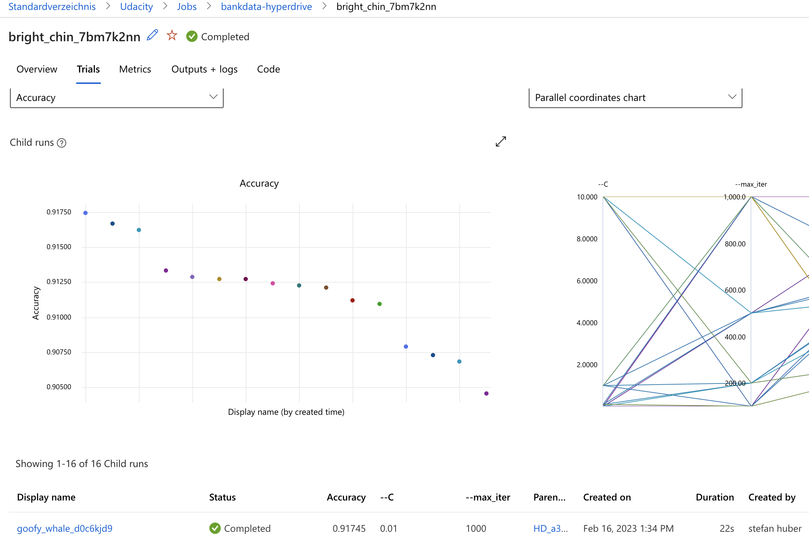
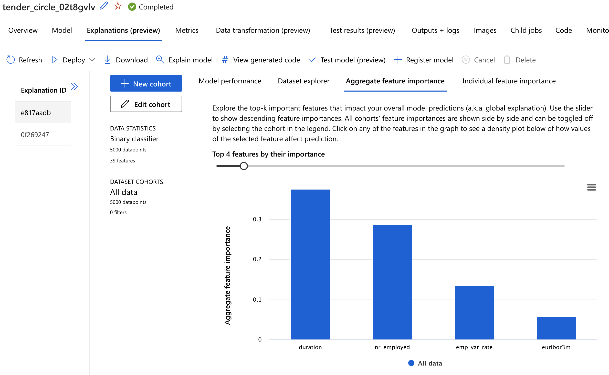

# Optimizing an ML Pipeline in Azure

## Overview

This project is part of the Udacity Azure ML Nanodegree.
In this project, we build and optimize an Azure ML pipeline using the Python SDK and a provided Scikit-learn model.
The models hyperparameters are then tuned with Hyperdrive.
The resulting model is then compared to the best model generated found by Azure AutoML.

## Useful Resources

- [ScriptRunConfig Class](https://docs.microsoft.com/en-us/python/api/azureml-core/azureml.core.scriptrunconfig?view=azure-ml-py)
- [Configure and submit training runs](https://docs.microsoft.com/en-us/azure/machine-learning/how-to-set-up-training-targets)
- [HyperDriveConfig Class](https://docs.microsoft.com/en-us/python/api/azureml-train-core/azureml.train.hyperdrive.hyperdriveconfig?view=azure-ml-py)
- [How to tune hyperparamters](https://docs.microsoft.com/en-us/azure/machine-learning/how-to-tune-hyperparameters)

## Summary

The project uses the [UCI Bank Marketing Data Set](https://archive.ics.uci.edu/ml/datasets/bank+marketing) which tracks the
subscription rates of bank clients to a term deposit. The dataset contains data about the client (age, job etc.), data about
the campaign (contact duration, previous contacts) as well as macroeconomic data (consumer price index, employment numbers).
The question we want to answer is **what are the predictors for a client to subscribe to a term deposit**.

Both methods (Hyperdrive vs. AutoML) deliver similarly performing models as you will see below.

## Scikit-learn Pipeline

The scikit learn pipeline uses a **train.py** script which does the heavy lifting (data cleaning, training and saving the model)
and can be parameterized with various hyperparameters (C and max-iter) for logistic regression.
Hyperdrive is then responsible for running the script with different
parameters sampled from the parameter space using a RandomParameterSampler which is usually faster than exhaustively trying
all parameter combinations. The BanditPolicy makes sure the job is terminated when the model can no longer be improved.

The best Hyperdrive model has the following properties:

- Test set accuracy: _.918_
- Regularization Strength: _.01_
- Max. Iterations: _1000_



## AutoML

The AutoML pipeline reuses the clean_data function from the training script and then starts an AutoML training run with
a 5 fold cross-validation and a test data set size of 20%.

The best AutoML model has the following properties:

- Test set accuracy: _.914_
- XGBoost classifier with the following hyper parameters

```json
{
  "booster": "gbtree",
  "colsample_bytree": 1,
  "eta": 0.05,
  "gamma": 0,
  "max_depth": 6,
  "max_leaves": 0,
  "n_estimators": 200,
  "objective": "reg:logistic",
  "reg_alpha": 0.625,
  "reg_lambda": 0.8333333333333334,
  "subsample": 0.8,
  "tree_method": "auto"
}
```

Interestingly the best predictors are not the sociodemographic attributes of the bank client but rather
macroeconomic factors like interest rates and changes in employment. The biggest factor however is
naturally the call duration. Since this is not known before making the call it is not useful in
predicting subscriptions and should be removed from the data.



## Pipeline comparison

Both models have similar accuracy and perform similarly well. However AutoMLs best model is an Ensemble/Decision Tree based model which is
a completely different algorithm compared to Hyperdrives LogisticRegression model.
Both models are good choices because they are easily explainable.

## Future work

- Target classes are imbalanced: Only about 11% of data records are of class y=0. Accuracy is therefore not a good metric and should be replaced by precision/recall or ROC/AUC.
- In order to improve the Hyperdrive model we could increase the sample space of paramter values
- sklearns LogisticRegression class has more hyperparameters which could be useful in tuning the model (e. g. class_weight for imbalanced classes, l1/l2 penalty or using a different solver like "newton-cholesky")
- Apply scaling/normalization to logistic regression model: train.py does not normalize/standardize numerical columns (while AutoML does). This could also improve the model performance.
- Use hyperdrive on ensemble model: Since AutoML found a good XGBoost model we could switch from LogisticRegression to XGBoost and try to tune that even further.
- We could also use cross-validation in our Hyperdrive training
- Only a handful of features have real predictive qualities. We should remove features which are not useful for prediction.
- Call duration can not be used as a predictor and should be removed from the data
